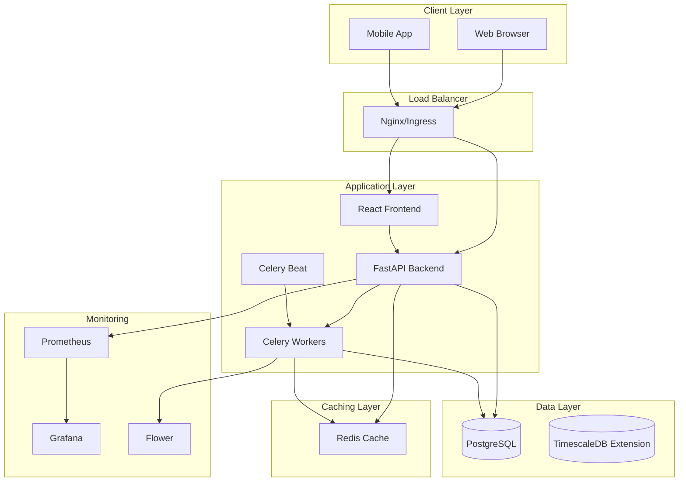
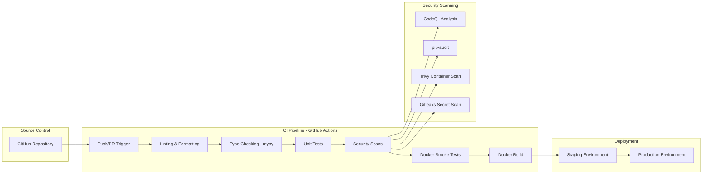

# KeneyApp Architecture Documentation

## System Overview

KeneyApp is a world-class healthcare management platform designed for GDPR/HIPAA compliance, high performance, and enterprise scalability.

## Architecture Diagram

## CI/CD Pipeline Architecture

### CI/CD Pipeline Stages

1. **Code Quality Checks**
   - Black code formatting verification
   - Flake8 linting (critical errors only)
   - mypy type checking (gradual typing)
   - Frontend ESLint and Prettier checks

2. **Testing**
   - Backend unit tests with pytest (77% coverage)
   - Frontend unit tests with Jest
   - API contract tests (JSON Schema validation)
   - Docker compose smoke tests (critical API flows)

3. **Security Scanning**
   - CodeQL static analysis (Python & TypeScript)
   - pip-audit for Python dependency vulnerabilities
   - npm audit for Node.js dependency vulnerabilities
   - Trivy container security scanning
   - Gitleaks secret detection
   - detect-secrets baseline verification

4. **Docker Build & Smoke Testing**
   - Build backend and frontend containers
   - Start full docker compose stack
   - Wait for health endpoints
   - Execute smoke test suite:
     - Health checks
     - Authentication flow
     - Patient management
     - Appointment listing
     - Dashboard statistics
     - Access control verification

5. **Deployment** (on main/develop branches)
   - Build and tag Docker images
   - Push to container registry
   - Deploy to staging environment
   - Run automated smoke tests
   - Promote to production (manual approval)

### Continuous Improvement Cycle Integration

The CI/CD pipeline supports the continuous improvement methodology:
- Automated weekly security scans (Monday 9 AM UTC)
- All PRs trigger full pipeline validation
- Security findings uploaded to GitHub Security tab
- Coverage reports tracked over time
- Performance regression detection (planned)

## Technology Stack

### Backend
- **Framework**: FastAPI 0.115.0
- **Language**: Python 3.11+
- **ORM**: SQLAlchemy 2.0
- **Migrations**: Alembic
- **Authentication**: JWT (python-jose)
- **Password Hashing**: Bcrypt
- **Validation**: Pydantic 2.9

### Frontend
- **Framework**: React 18
- **Language**: TypeScript 5.3
- **Routing**: React Router v6
- **HTTP Client**: Axios
- **Testing**: Jest + React Testing Library

### Database
- **Primary Database**: PostgreSQL 15
- **Extension**: TimescaleDB (for time-series data)
- **Connection Pooling**: SQLAlchemy connection pool

### Caching & Message Queue
- **Cache**: Redis 7
- **Task Queue**: Celery 5.3
- **Message Broker**: Redis
- **Result Backend**: Redis
- **Monitoring**: Flower

### Infrastructure
- **Containerization**: Docker
- **Orchestration**: Kubernetes
- **Ingress**: Nginx Ingress Controller
- **Auto-scaling**: Horizontal Pod Autoscaler
- **CI/CD**: GitHub Actions

### Monitoring & Observability
- **Metrics**: Prometheus
- **Visualization**: Grafana
- **Logging**: Application logs (JSON format)
- **Health Checks**: Built-in endpoints

## Core Components

### 1. Authentication & Authorization

#### JWT-based Authentication
- Access tokens with configurable expiration
- Refresh token support (planned)
- Role-based access control (RBAC)

#### User Roles
- **Admin**: Full system access
- **Doctor**: Patient management, appointments, prescriptions
- **Nurse**: Patient records, basic appointments
- **Receptionist**: Appointment scheduling, patient registration

### 2. Audit Logging

All critical operations are logged for GDPR/HIPAA compliance:
- User authentication events
- Patient record access/modifications
- Prescription creation/updates
- Appointment management
- Administrative actions

Audit logs include:
- Timestamp
- User ID and username
- Action performed
- Resource type and ID
- IP address
- User agent
- Additional contextual details
- Success/failure status

### 3. Rate Limiting

Protection against abuse and DDoS attacks:
- IP-based rate limiting
- Per-endpoint rate limits
- Configurable thresholds
- Automatic rate limit headers in responses

### 4. Caching Strategy

Redis-based caching for performance optimization:
- Dashboard statistics (5-minute TTL)
- Patient list queries (2-minute TTL)
- Appointment schedules (1-minute TTL)
- User profile data (10-minute TTL)

Cache invalidation on data updates.

### 5. Background Tasks

Celery handles asynchronous operations:
- **Appointment Reminders**: Send notifications before appointments
- **Report Generation**: Create patient reports asynchronously
- **Drug Interaction Checks**: Validate prescriptions against interaction databases
- **Data Backups**: Automated backup routines
- **Token Cleanup**: Remove expired authentication tokens

### 6. Security Features

#### Data Protection
- Password hashing with bcrypt (12 rounds)
- JWT token encryption
- HTTPS enforcement in production
- SQL injection prevention (ORM-based queries)
- XSS protection headers
- CSRF protection
- Content Security Policy

#### Security Headers
- X-Content-Type-Options: nosniff
- X-Frame-Options: DENY
- X-XSS-Protection: 1; mode=block
- Strict-Transport-Security: max-age=31536000
- Content-Security-Policy: default-src 'self'

#### HIPAA Compliance
- Audit logging of all PHI access
- Data encryption in transit (TLS)
- Data encryption at rest (planned: pgcrypto)
- Access control and authentication
- Automatic session timeout
- Secure data disposal

## Data Models

### User
- Authentication and profile information
- Role-based permissions
- Activity tracking

### Patient
- Personal information
- Medical history (JSONB structure planned)
- Contact details
- Emergency contacts
- Allergies and conditions

### Appointment
- Scheduling information
- Patient and doctor relationships
- Status tracking
- Notes and history

### Prescription
- Medication details
- Dosage and instructions
- Doctor and patient relationships
- Refill information

### AuditLog
- Comprehensive activity tracking
- Compliance and security monitoring
- Forensic analysis capability

## API Design

### RESTful Principles
- Resource-based URLs
- Standard HTTP methods (GET, POST, PUT, DELETE)
- JSON request/response format
- Consistent error handling
- Pagination support

### Versioning
- URL-based versioning: `/api/v1/`
- Backward compatibility maintained

### Documentation
- Auto-generated OpenAPI/Swagger docs
- ReDoc alternative documentation
- Interactive API testing

### Rate Limits
- Default: 100 requests per minute per IP
- Authentication: 10 requests per minute
- Sensitive endpoints: Lower limits

## Deployment Architecture

### Development Environment
- Docker Compose for local development
- Hot-reload for rapid iteration
- SQLite option for quick setup
- Sample data seeding

### Production Environment
- Kubernetes cluster deployment
- Horizontal scaling (3-10 backend pods)
- Load balancing with Nginx Ingress
- SSL/TLS termination at ingress
- Health checks and auto-recovery
- Rolling updates with zero downtime

### High Availability
- Multiple backend replicas
- Database replication (planned)
- Redis Sentinel (planned)
- Multi-zone deployment
- Automated failover

## Monitoring & Observability

### Metrics Collection
- Request rate and duration
- Error rates by endpoint
- Database query performance
- Cache hit/miss rates
- Queue length and processing time
- Resource utilization (CPU, memory)

### Custom Healthcare Metrics
- Patient operations per hour
- Appointment bookings rate
- Prescription creation rate
- Active user count
- System availability

### Alerting
- High error rates
- Slow response times
- Database connection issues
- High memory usage
- Failed background tasks

## Scalability Considerations

### Horizontal Scaling
- Stateless backend services
- Session management via JWT (no server-side state)
- Database connection pooling
- Distributed caching

### Performance Optimization
- Database query optimization
- Eager loading of relationships
- Index optimization
- Response compression
- Asset optimization (frontend)

### Future Enhancements
- GraphQL API alongside REST
- Read replicas for database
- CDN for static assets
- Microservices architecture (if needed)
- Event-driven architecture with message queues

## Security Best Practices

1. **Never commit secrets** to version control
2. **Use environment variables** for configuration
3. **Implement rate limiting** on all public endpoints
4. **Validate all inputs** with Pydantic schemas
5. **Use parameterized queries** (via ORM)
6. **Implement proper CORS** policies
7. **Use HTTPS** in production
8. **Regular security audits** and dependency updates
9. **Implement proper logging** without sensitive data
10. **Follow principle of least privilege**

## Testing Strategy

### Backend Testing
- Unit tests for business logic
- Integration tests for API endpoints
- Database migration tests
- Security testing (OWASP)

### Frontend Testing
- Component unit tests
- Integration tests
- End-to-end tests with Cypress (planned)

### Performance Testing
- Load testing with locust (planned)
- Stress testing
- Capacity planning

## Backup & Recovery

### Database Backups
- Automated daily backups
- Point-in-time recovery capability
- Backup retention: 30 days
- Backup verification

### Disaster Recovery
- Recovery Time Objective (RTO): 4 hours
- Recovery Point Objective (RPO): 24 hours
- Documented recovery procedures
- Regular DR drills

## Compliance

### GDPR
- Right to access
- Right to erasure
- Data portability
- Consent management
- Data breach notification

### HIPAA
- Access controls
- Audit trails
- Data encryption
- Secure transmission
- Business associate agreements

## Maintenance

### Regular Tasks
- Security patches
- Dependency updates
- Database optimization
- Log rotation
- Certificate renewal

### Monitoring
- Daily health checks
- Weekly performance reviews
- Monthly security audits
- Quarterly compliance reviews

## Support & Documentation

- API documentation: `/api/v1/docs`
- User guides: `/docs` directory
- Developer guides: This file
- Runbooks: `/docs/runbooks`
- Troubleshooting: `/docs/troubleshooting`
