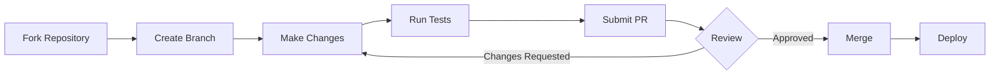

# Project Governance

This document outlines the governance structure and decision-making processes for the KeneyApp project.

## Project Ownership

**KeneyApp** is proprietary software owned and maintained by **Issa Sanogo**.

- **Owner**: Issa Sanogo
- **License**: Proprietary (See [LICENSE](LICENSE))
- **Contact**: <issasanogo2000@gmail.com>

## Project Structure

### Maintainers

Project maintainers are team members responsible for:

- Reviewing and merging pull requests
- Managing releases and versioning
- Triaging and prioritizing issues
- Maintaining code quality and standards
- Making architectural decisions

### Contributors

Contributors are individuals who:

- Submit pull requests
- Report issues and bugs
- Participate in discussions
- Improve documentation
- Test and provide feedback

All contributions must follow our [Contributing Guide](CONTRIBUTING.md) and [Code of Conduct](CODE_OF_CONDUCT.md).

## Decision-Making Process

### 1. Minor Changes

- **Examples**: Bug fixes, documentation updates, small improvements
- **Process**:
  - Submit a pull request
  - Requires 1 maintainer approval
  - Automated tests must pass
  - Can be merged directly after approval

### 2. Major Changes

- **Examples**: New features, breaking changes, architectural modifications
- **Process**:
  - Open an issue first to discuss the proposal
  - Gather feedback from maintainers and community
  - Submit a pull request with detailed description
  - Requires 2 maintainer approvals
  - All tests and quality checks must pass
  - Final decision by project owner

### 3. Security Issues

- **Process**:
  - Follow [Security Policy](SECURITY.md)
  - Report privately to security team
  - Coordinated disclosure after patch is ready
  - Emergency releases as needed

## Contribution Workflow

### Steps

1. **Fork and Clone**: Fork the repository and create a feature branch
2. **Develop**: Make your changes following our coding standards
3. **Test**: Ensure all tests pass and add new tests for new features
4. **Document**: Update documentation as needed
5. **Submit**: Create a pull request with a clear description
6. **Review**: Address feedback from maintainers
7. **Merge**: Once approved, changes are merged by maintainers

## Code Review Standards

All code must meet these standards before merging:

- ✅ Follows [coding standards](CONTRIBUTING.md#coding-standards)
- ✅ Includes appropriate tests (target: >80% coverage)
- ✅ Documentation updated (if applicable)
- ✅ All CI/CD checks pass
- ✅ No merge conflicts
- ✅ Approved by required number of maintainers
- ✅ Security scan passes (CodeQL, dependency audit)

## Branching Strategy

We follow **Git Flow**:

- `main` - Production-ready code, tagged with version numbers
- `develop` - Integration branch for ongoing development
- `feature/*` - New features (branch from `develop`)
- `bugfix/*` - Bug fixes (branch from `develop`)
- `hotfix/*` - Urgent production fixes (branch from `main`)
- `release/*` - Release preparation (branch from `develop`)

## Release Process

### Versioning

We follow [Semantic Versioning](https://semver.org/) (SemVer):

- **MAJOR.MINOR.PATCH** (e.g., 2.0.1)
  - **MAJOR**: Breaking changes
  - **MINOR**: New features (backwards compatible)
  - **PATCH**: Bug fixes (backwards compatible)

### Release Cycle

1. **Feature Freeze**: Stop merging new features to `develop`
2. **Create Release Branch**: `release/vX.Y.Z` from `develop`
3. **Testing**: Comprehensive testing and bug fixes on release branch
4. **Documentation**: Update CHANGELOG.md and version numbers
5. **Merge to Main**: Merge release branch to `main`
6. **Tag**: Create Git tag (e.g., `v2.0.0`)
7. **Deploy**: Deploy to production environments
8. **Merge Back**: Merge `main` back to `develop`

See [CHANGELOG.md](CHANGELOG.md) for release history.

## Issue Management

### Priority Levels

- **Critical**: Security vulnerabilities, data loss, system down
- **High**: Major functionality broken, significant performance issues
- **Medium**: Minor functionality issues, moderate improvements
- **Low**: Small bugs, nice-to-have features, cosmetic issues

### Labels

We use GitHub labels to categorize issues:

- `bug` - Something isn't working
- `enhancement` - New feature or request
- `documentation` - Documentation improvements
- `security` - Security-related issues
- `performance` - Performance improvements
- `good first issue` - Good for newcomers
- `help wanted` - Extra attention needed
- `wontfix` - This will not be worked on
- `duplicate` - Already reported elsewhere

## Communication

### Channels

- **GitHub Issues**: Bug reports, feature requests
- **GitHub Discussions**: Questions, general discussions
- **Pull Requests**: Code review, technical discussions
- **Email**: <issasanogo2000@gmail.com> (business inquiries)

### Response Times

- **Critical Issues**: 24 hours
- **High Priority Issues**: 48 hours
- **Other Issues**: 1 week
- **Pull Requests**: 1 week for initial review

## Conflict Resolution

If disagreements arise:

1. Discuss respectfully in the relevant GitHub issue or PR
2. Seek input from additional maintainers
3. If consensus cannot be reached, Issa Sanogo makes the final decision
4. All participants must follow the [Code of Conduct](CODE_OF_CONDUCT.md)

## Code of Conduct

All community members must adhere to our [Code of Conduct](CODE_OF_CONDUCT.md). Violations will be taken seriously and may result in:

1. **Warning**: First offense, documented warning
2. **Temporary Ban**: Repeat offense, temporary suspension from project
3. **Permanent Ban**: Serious violations or repeated misconduct

## Amendments

This governance document may be updated by Issa Sanogo as the project evolves. Major changes will be announced through GitHub discussions.

**Last Updated**: November 2025

---

Made with ❤️ by Issa Sanogo
