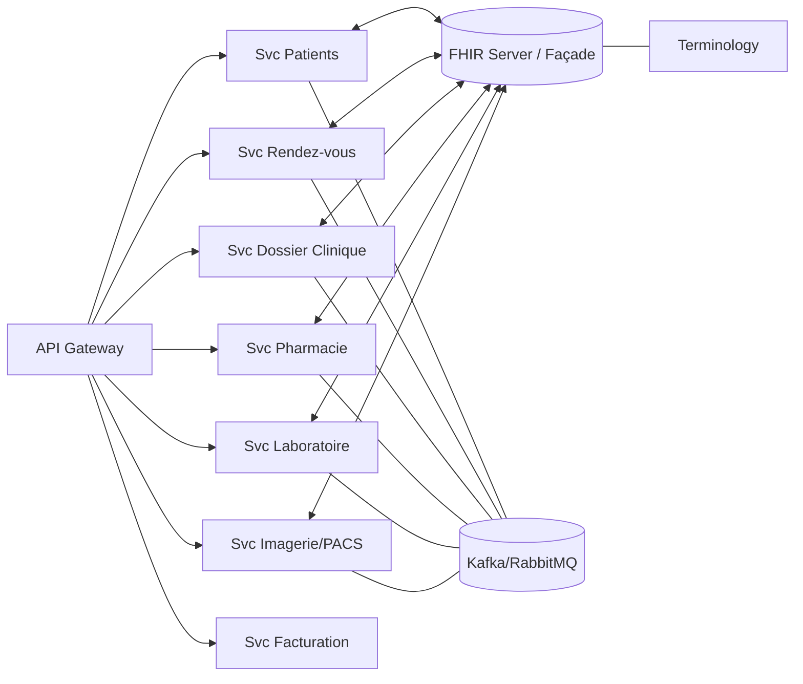
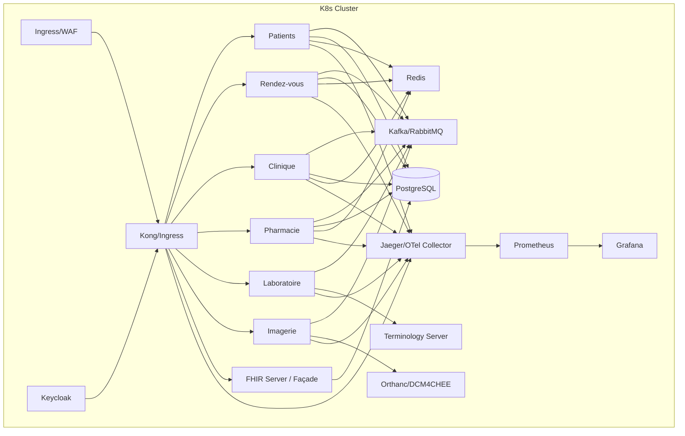

# Alignement Architecture DMI (2025) — KeneyApp

Ce document aligne la vision d’un Dossier Médical Informatisé (DMI) cloud‑native, interopérable (FHIR‑first), sécurisé et conforme (RGPD/HDS/HIPAA) avec l’architecture actuelle de KeneyApp, et propose un plan de migration par phases.

## 1. Résumé exécutif

- État actuel: Backend FastAPI monolithique modulaire (routers/services/models), PostgreSQL, Redis, Celery, métriques Prometheus, GraphQL, FHIR R4 partiel (convertisseurs Patient/Appointment/MedicationRequest/Condition/Observation/Procedure), multi‑tenant, CI GitHub Actions, k8s manifests.
- Vision cible: Architecture microservices cloud‑native, FHIR‑first (R4, anticipation R5), interop (HL7 v2, DICOM), terminologies (SNOMED CT, LOINC, ICD‑11, ATC, CCAM/CPT), sécurité OAuth2/OIDC + RBAC/ABAC, observabilité OTel, conformité RGPD/HDS/HIPAA, déploiement Kubernetes avec API Gateway, option FHIR server central (HAPI FHIR JPA).
- Stratégie: Migration incrémentale en 5 phases, en commençant par FHIR complet côté API, terminologies et events, puis désagrégation progressive des domaines (patients, rendez‑vous, pharmacie, labo, imagerie), et ajout HL7 v2/DICOM.

## 2. État actuel (constaté dans le repo)

- Backend: `app/` (FastAPI). Routage REST dans `app/routers`, services métier `app/services`, schémas `app/schemas`, modèles ORM `app/models`, core platform `app/core` (config, sécurité, DB, cache, rate limit, métriques, audit). GraphQL via `app/graphql`.
- FHIR: Convertisseurs dans `app/fhir/converters.py` couvrant Patient, Appointment, MedicationRequest, Condition, Observation, Procedure. Documentation `docs/FHIR_GUIDE.md`. Endpoints FHIR exposés via `app/routers/fhir.py`.
- Données/terminologies: Modèles `MedicalCode`, `Observation`, `Condition`, `Procedure`, `LabResult` dans `app/models`. Alembic inclut colonnes/indices pour LOINC, SNOMED CT, ICD‑11, ATC, CPT, CCAM.
- Sécurité: JWT, RBAC basique via dépendances, audit, rate limiting context‑aware, chiffrement PHI (services dédiés), multi‑tenant.
- Infra: PostgreSQL, Redis, Celery, Prometheus/Grafana, k8s manifests. CI/CD GitHub Actions (lint, tests, sécurité de base, build Docker, smoke tests). 

## 3. Vision cible DMI (2025)

- Frontend: React + TypeScript, design system (MUI), accessibilité, API‑first.
- Backends microservices par domaine (patients/ADT, agendas, dossier clinique, pharmacie, laboratoire, imagerie/PACS, facturation/admin, intégration/interop), communications REST/gRPC et événements.
- Interopérabilité: FHIR R4 (préparation R5), HL7 v2 (ADT/ORM/ORU), DICOM/DICOMweb (XDS‑I), IHE profils, FHIR Subscriptions, SMART‑on‑FHIR.
- Terminologies: Serveur dédié (SNOMED CT, LOINC, ICD‑11, ATC, CCAM/CPT), validation/mapping.
- Données: Option A (FHIR‑central) via serveur FHIR (HAPI FHIR JPA + Postgres) comme source de vérité; Option B (poly‑DB par service) avec façade FHIR et synchro par événements.
- Sécu/conformité: OAuth2/OIDC (Keycloak), RBAC + ABAC/OPA, mTLS (service mesh), chiffrement TLS 1.3 et au repos (KMS/Vault), audit immuable, RGPD/HDS/HIPAA by design.
- Observabilité: OpenTelemetry (traces/metrics/logs), Prometheus/Grafana, Jaeger, corrélation bout‑en‑bout.

## 4. Alignement et écarts majeurs

| Domaine | État actuel | Écart vs vision | Action proposée |
|---|---|---|---|
| API FHIR | Convertisseurs et endpoints R4 partiels | Manque search, bundles, versioning, Subscriptions | Étendre FHIR (Section 5.1) |
| Terminologies | Tables codes + champs LOINC/SNOMED/ICD/ATC | Pas de serveur de terminologie | Intégrer un serveur (Section 5.2) |
| Labo | Modèle `LabResult` | HL7 v2 ORU/ORM, mapping LOINC/Observation | Microservice Labo + HL7 engine (5.4) |
| Imagerie | Enum DICOM et documents | PACS, DICOMweb, XDS‑I, viewer | Microservice Imagerie + Orthanc/DCM4CHEE (5.5) |
| Intégration | REST et FHIR partiel | HL7 v2 engine, API Gateway, events | Mirth/NextGen Connect, Kong/NGINX, Kafka/RabbitMQ (5.3, 5.4) |
| Sécurité | JWT + RBAC | OIDC, SMART‑on‑FHIR, ABAC/OPA, mTLS | Keycloak, OPA, mesh (5.6) |
| Observabilité | Prometheus/Grafana, corrélation | OTel traces + Jaeger | Instrumentation OTel (5.7) |
| Données | Postgres central + ORM | FHIR‑central ou poly‑DB | Décision Option A/B (5.8) |
| DevOps | CI Actions complète | DAST, SBOM, GitOps, Helm | Étendre pipeline + ArgoCD (5.9) |

## 5. Plan de migration par phases (12–18 mois)

### Phase 1 — FHIR‑first et fondations (0–3 mois)
- Étendre FHIR R4: 
  - Recherche (search parameters standards) sur Patient/Appointment/Observation.
  - OperationOutcome uniforme, CapabilityStatement enrichi.
  - Bundles (transaction batch minimal), ETag/versionId pour ressources clés.
- Conformité données: compléter convertisseurs pour Condition/Procedure (déjà présents) avec validations strictes.
- Terminologies: intégrer un serveur (ex. Snowstorm SNOMED + LOINC) via un service interne `terminology` avec cache Redis; endpoints de validation/mapping.
- Sécurité: OIDC (Keycloak) en frontal de l’API, JWT signés, scopes SMART‑on‑FHIR de base; mapping des rôles vers claims.
- Observabilité: instrumentation OpenTelemetry côté FastAPI et workers; export Jaeger/OTLP.

Critères d’acceptation:
- Endpoints FHIR avec search + OperationOutcome + CapabilityStatement complet.
- Tests d’intégration FHIR étendus; couverture ≥ 78% backend.
- Authn via OIDC valide en staging; traces OTel visibles dans Jaeger.

### Phase 2 — API Gateway, événements, découpage initial (3–6 mois)
- API Gateway: Kong ou NGINX Ingress + policies (authn, rate limit, quotas, WAF de base).
- Bus d’événements: Kafka ou RabbitMQ pour notifications domaine (Patient, Appointment, Prescription) et intégrations.
- Découpage: extraire un premier microservice « Appointments » (FastAPI/NestJS), base dédiée (ou accès FHIR), contrats stables.
- FHIR Subscriptions: notifier les services sur création/modif de ressources clés (Appointment, MedicationRequest).

Critères d’acceptation:
- Gateway en prod avec OIDC/JWT, rate limit centralisé.
- Événements Appointment publiés/consommés; microservice autoscalable.

### Phase 3 — Laboratoire et interop HL7 v2 (6–9 mois)
- HL7 engine (Mirth/NextGen Connect): canaux ORM/ORU vers/depuis SI Labo, ack/retry, transformation vers FHIR Observation (LOINC).
- Microservice Labo: mapping ServiceRequest ↔ HL7, persistence Observation; règles de validation référence/intervalle.

Critères d’acceptation:
- Flux e2e: création demande labo → résultat ORU → Observation FHIR sur patient.
- Latence < 2 min 95e perc. sur intégration de résultats.

### Phase 4 — Imagerie/PACS et DICOM (9–12 mois)
- PACS: Orthanc ou DCM4CHEE; stockage objet; DICOMweb (WADO/QIDO/STOW) + viewer web embeddable.
- Microservice Imagerie: ServiceRequest radiologie, `ImagingStudy` + `DiagnosticReport`, liens vers séries/instances.
- IHE XDS‑I pour partage inter‑établissements (si périmètre requis).

Critères d’acceptation:
- Consultation d’images DICOM depuis DMI avec contrôle d’accès.
- Indice de disponibilité PACS ≥ 99.9% mensuel.

### Phase 5 — Sécurité avancée, conformité et durcissement (12–18 mois)
- ABAC via OPA (policies: consentements, service/attribution, BTG), journaux d’audit immuables.
- mTLS intra‑cluster via service mesh (Istio/Linkerd), rotation certs, politiques Zero Trust.
- HDS/HIPAA: procédures, preuves, sauvegardes chiffrées, PRA/PCA, tests de restauration.

Critères d’acceptation:
- Audits de conformité internes passés; panoplie d’alertes sécurité active.
- PRA testé avec RTO≤4h, RPO≤24h.

## 6. Options d’architecture données (décision à prendre)

- Option A — FHIR‑central: déployer un serveur FHIR (HAPI FHIR JPA + PostgreSQL) comme store primaire. Avantages: conformance native, recherche, history, transactions; Inconvénients: couplage fort aux profils; besoin d’extensions pour logique métier.
- Option B — Microservices avec DB par domaine + façade FHIR: chaque service persiste son modèle, expose REST interne, et publie/consomme des événements; un service FHIR compose les vues/ressources. Avantages: autonomie forte; Inconvénients: complexité d’agrégation et de cohérence.

Recommandation: démarrer en B (façade FHIR enrichie) tout en préparant la compatibilité A pour certains domaines (Observation, ImagingStudy) où HAPI apporte de la valeur immédiate.

## 7. Sécurité & conformité (cible et trajectoire)

- Authentification/autorisation: Keycloak (OIDC), scopes SMART‑on‑FHIR, RBAC par rôle (Admin, Médecin, Infirmier, Secrétaire), ABAC (OPA) selon attributs (service, consentement, contexte de soins), BTG journalisé.
- Chiffrement: TLS 1.3 partout; au repos via KMS/Vault; secrets hors code; journaux sans PHI; pseudonymisation si analytique.
- Audit: `AuditEvent` FHIR pour opérations cliniques; stockage WORM/immuable; corrélation par ID de requête.
- Réseau: segmentation k8s (NetworkPolicies), WAF en frontal, mTLS service mesh.

## 8. Observabilité

- OpenTelemetry: instrumentation FastAPI/Celery/DB/HTTP; export OTLP → Jaeger/Tempo.
- Prometheus: métriques techniques et métiers (patients/j, délai labo, taux d’erreurs FHIR, latences par ressource).
- Alerting: Alertmanager/PagerDuty; SLO (ex: latence p95 FHIR < 300 ms, erreurs 5xx < 0.5%).

## 9. DevOps & Qualité

- CI/CD: étendre GitHub Actions avec SBOM (Syft), Trivy scan, DAST (ZAP baseline), SAST (CodeQL), IaC scan (k8s/Helm), tests de charge périodiques (k6/JMeter), contract tests FHIR (capabilities + profiles).
- GitOps: Argo CD/Flux + Helm charts; promotions staging→prod avec approbation.
- Données: migrations Alembic contrôlées; anonymisation datasets pour staging.

## 10. Backlog priorisé (12 prochaines semaines)

1. Étendre endpoints FHIR: search Patient/Appointment, OperationOutcome homogène, CapabilityStatement complet.
2. Service `terminology`: introspection SNOMED/LOINC/ICD/ATC via API distante + cache Redis; endpoints de validation/codage.
3. API Gateway (ingress + auth OIDC), rate limiting central, journaux d’accès.
4. Événements domaine (Kafka/RabbitMQ) + Subscriptions FHIR (Appointment/MedicationRequest).
5. PoC HL7 v2 (Mirth) pour ORU→Observation avec 1 panel LOINC; mapping minimal; tests d’intégration.

## 11. Risques & parades

- Complexité FHIR (search/transactions): démarrer par profils resserrés + tests de conformance.
- Gouvernance terminologies (licences SNOMED): gérer via contrat/serveur interne; mise en cache et anonymisation.
- Endettement si double modèle (façade FHIR + ORM): générer artefacts FHIR à partir d’événements pour réduire divergence.
- Sécurité/Conformité: intégrer SecOps en CI et preuves HDS dès Phase 1.

## 12. Indicateurs (KPIs)

- Taux de conformité FHIR (tests de profils) ≥ 95% sur ressources cibles.
- Latence p95 API FHIR < 300 ms; erreurs 4xx/5xx par ressource.
- Délai e2e résultat labo (ORU→Observation) p95 < 2 min.
- Couverture tests backend ≥ 80% d’ici Phase 2; alertes SLO < 2/mois.

---

Annexes: 
- Diagramme logique (Mermaid)

- Diagramme physique (Mermaid)

