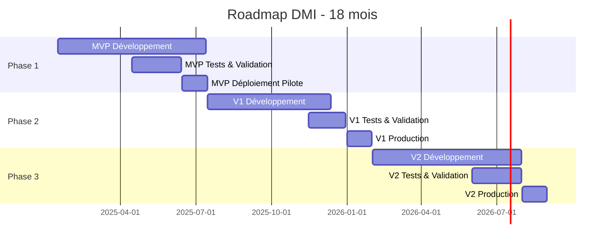

# Plan de Livraison et Roadmap - DMI

## 1. Vue d'Ensemble Exécutive

### 1.1 Objectif du Projet

Développer et déployer un Dossier Médical Informatisé (DMI) de niveau production, conforme aux standards internationaux (FHIR R4, terminologies médicales), sécurisé (RGPD/HDS/HIPAA), et scalable pour :
- GHU (Groupements Hospitaliers Universitaires)
- Hôpitaux de taille moyenne
- Cabinets médicaux
- Médecins indépendants

### 1.2 Timeline Globale

### 1.3 Investissement et Équipe

#### Budget Estimé (18 mois)

| Phase | Durée | Équipe | Budget Estimé |
|-------|-------|--------|---------------|
| **MVP (Phase 1)** | 6 mois | 6 personnes | 360 K€ |
| **V1 (Phase 2)** | 6 mois | 8 personnes | 480 K€ |
| **V2 (Phase 3)** | 6 mois | 10 personnes | 600 K€ |
| **Infra & Ops** | 18 mois | 2 personnes | 180 K€ |
| **Total** | 18 mois | 10 FTE (moyenne) | **1.62 M€** |

#### Composition Équipe

| Rôle | Phase 1 (MVP) | Phase 2 (V1) | Phase 3 (V2) |
|------|---------------|--------------|--------------|
| **Product Owner** | 1 | 1 | 1 |
| **Tech Lead / Architecte** | 1 | 1 | 1 |
| **Backend Developers** | 2 | 3 | 4 |
| **Frontend Developers** | 1 | 2 | 2 |
| **DevOps / SRE** | 0.5 | 1 | 1 |
| **QA / Test Engineer** | 0.5 | 1 | 1 |
| **UX Designer** | 0.5 | 0.5 | 0.5 |
| **Data Engineer** | 0 | 0.5 | 1 |
| **Security / DPO Support** | 0.5 | 0.5 | 0.5 |
| **Total FTE** | **6** | **8** | **10** |

## 2. Phase 1 : MVP (Mois 1-6)

### 2.1 Objectifs MVP

**Périmètre Fonctionnel** :
- ✅ Identito-vigilance (création, recherche patient, gestion INS)
- ✅ Dossier patient (antécédents, allergies, traitements)
- ✅ Consultation ambulatoire (anamnèse, examen, constantes)
- ✅ Prescription médicamenteuse (base interactions, génération ordonnance)
- ✅ Documents médicaux (upload, stockage, génération PDF)
- ✅ RBAC (4 rôles : Admin, Médecin, IDE, Secrétaire)
- ✅ Sécurité (JWT, chiffrement, audit logging)

**Critères de Succès MVP** :
- 70% adoption utilisateurs pilotes (1 cabinet + 1 service hospitalier)
- < 7 min temps saisie consultation
- 95% complétude INS
- 0 incident sécurité majeur
- 99% disponibilité

### 2.2 Sprint Planning (Sprints de 2 semaines)

#### Sprint 1-2 : Fondations & Identito-Vigilance (M1)

**Objectifs** :
- Setup environnements (dev, staging, prod)
- CI/CD pipeline (GitHub Actions)
- Architecture backend (FastAPI + PostgreSQL + Redis)
- Module Patient CRUD
- Intégration téléservice INS (mock + prod)
- Détection doublons

**User Stories** :
- US-001 : Recherche patient par INS
- US-002 : Création patient avec validation INS
- US-003 : Gestion doublons

**Livrables** :
- Backend : API REST patients (CRUD)
- Frontend : Pages création/recherche patient
- Tests : Unitaires + intégration (couverture 80%)
- Docs : API Swagger, guide dev

#### Sprint 3-4 : Dossier Patient & Allergies (M2)

**Objectifs** :
- Gestion allergies/intolérances
- Antécédents médicaux structurés
- Traitements en cours
- Chiffrement données sensibles

**User Stories** :
- US-004 : Saisie allergies avec codes SNOMED CT
- US-005 : Historique médical patient
- US-006 : Traitements en cours (liste)

**Livrables** :
- Backend : API allergies, conditions, medications
- Frontend : Composant dossier patient (onglets)
- Chiffrement : AES-256-GCM PHI
- Tests : Sécurité + encryption

#### Sprint 5-6 : Consultation & Observations (M3)

**Objectifs** :
- Module consultation (Encounter)
- Saisie constantes vitales
- Scores cliniques (IMC, clairance rénale)
- Templates consultation

**User Stories** :
- US-010 : Saisie consultation avec template
- US-011 : Saisie constantes avec validation
- US-012 : Calculs automatiques scores

**Livrables** :
- Backend : API encounters, observations
- Frontend : Formulaire consultation + constantes
- Validation : Plages valeurs (alertes)
- Tests : E2E consultation complète

#### Sprint 7-8 : Prescription Médicamenteuse (M4)

**Objectifs** :
- Prescription avec BDM (Base Données Médicamenteuse)
- Analyse interactions (Thériaque ou équivalent)
- Vérification allergies
- Génération ordonnance PDF

**User Stories** :
- US-020 : Prescription avec vérification interactions
- US-021 : Détection allergie bloquante
- US-040 : Génération ordonnance PDF

**Livrables** :
- Backend : API prescriptions + moteur interactions
- Intégration BDM (CIP/UCD + ATC)
- Frontend : Formulaire prescription + alertes
- Génération PDF : ordonnances conformes

#### Sprint 9-10 : Documents & Sécurité (M5)

**Objectifs** :
- Upload/download documents
- Signature électronique (e-CPS)
- Audit logging complet
- RBAC finalisé

**User Stories** :
- US-041 : Upload document médical
- US-042 : Signature électronique ordonnance
- US-050 : Consultation logs audit

**Livrables** :
- Backend : API documents (S3), audit logs
- Signature : Intégration e-CPS
- Frontend : Gestion documents
- Sécurité : Audit dashboard (DPO)

#### Sprint 11-12 : Tests, Optimisations, MVP Release (M6)

**Objectifs** :
- Tests de charge (1,000 patients, 100 utilisateurs concurrents)
- Optimisations performance (caching, indices DB)
- Documentation utilisateur
- Formation équipe pilote

**Livrables** :
- Tests : Performance, sécurité, accessibilité
- Documentation : Guide utilisateur, runbooks
- Formation : Vidéos, webinaires
- **MVP Release 1.0.0** : Déploiement environnement pilote

### 2.3 Déploiement Pilote MVP

#### Sites Pilotes

**Site 1 : Cabinet Médical**
- 3 médecins généralistes
- 1 secrétaire
- 50-80 patients/jour
- Durée pilote : 1 mois

**Site 2 : Service Hospitalier**
- Médecine interne (20 lits)
- 4 médecins, 8 IDE, 2 secrétaires
- 15-25 consultations/jour
- Durée pilote : 1 mois

#### Métriques de Suivi Pilote

| Métrique | Cible | Mesure |
|----------|-------|--------|
| **Taux adoption** | > 70% | Utilisateurs actifs / total |
| **Temps saisie consultation** | < 7 min | Moyenne durée workflow |
| **Complétude INS** | > 95% | % patients avec INS validé |
| **Satisfaction utilisateurs** | > 3.5/5 | NPS mensuel |
| **Incidents sécurité** | 0 | Alertes critiques |
| **Disponibilité** | > 99% | Uptime mesuré |

#### Support Pilote

- Hotline dédiée : 8h-20h, J+1
- Support on-site : 2 jours/semaine
- Feedback hebdomadaire : réunions utilisateurs
- Bug fixing : < 24h (critique), < 1 semaine (normal)

## 3. Phase 2 : V1 Production (Mois 7-12)

### 3.1 Objectifs V1

**Périmètre Fonctionnel Additionnel** :
- ✅ Agenda & RDV (multi-praticiens, ressources)
- ✅ Laboratoire (HL7 v2 ORM/ORU, résultats LOINC)
- ✅ Imagerie (PACS, DICOM, visionneuse)
- ✅ Messagerie sécurisée (interne + MSSanté)
- ✅ Tableaux de bord (file d'attente, KPI)
- ✅ Validation pharmaceutique
- ✅ FHIR R4 complet (search, bundles, subscriptions)

**Critères de Succès V1** :
- 90% adoption multi-sites (3 sites hospitaliers + 10 cabinets)
- < 5 min temps saisie consultation
- 98% complétude INS
- Latence p95 < 300 ms
- 99.5% disponibilité
- ROI positif (break-even < 12 mois)

### 3.2 Sprint Planning V1 (Sprints 13-24)

#### Sprints 13-15 : Agenda & Appointments (M7-8)

**Objectifs** :
- Gestion RDV multi-praticiens
- Planning salles et ressources
- Synchronisation calendriers
- Notifications RDV (email, SMS)

**Livrables** :
- API appointments (CRUD, search, conflicts)
- Frontend : Vue planning (jour, semaine, mois)
- Notifications : Celery tasks
- Tests : Conflits RDV, overbooking

#### Sprints 16-18 : Laboratoire & HL7 v2 (M8-9)

**Objectifs** :
- Intégration HL7 v2 (ORM demandes, ORU résultats)
- Mapping LOINC obligatoire
- Push notifications résultats critiques
- Historique et courbes évolution

**Livrables** :
- HL7 engine (Mirth ou custom)
- Backend : ServiceRequest, Observation (labo)
- Frontend : Demandes labo, résultats, graphiques
- Tests : Intégration LIS (mock + réel)

#### Sprints 19-21 : Imagerie & PACS (M10-11)

**Objectifs** :
- Intégration PACS (Orthanc ou DCM4CHEE)
- DICOMweb (WADO-RS, QIDO-RS)
- Visionneuse DICOM embarquée
- ImagingStudy FHIR

**Livrables** :
- PACS : Installation + configuration
- Backend : ImagingStudy, DiagnosticReport
- Frontend : Visionneuse DICOM (Cornerstone.js)
- Tests : Upload/download DICOM

#### Sprints 22-24 : Messagerie & Dashboards (M11-12)

**Objectifs** :
- Messagerie interne sécurisée
- Intégration MSSanté (SMTP sécurisé)
- Tableaux de bord temps réel
- Alertes personnalisées

**Livrables** :
- Messagerie : API messages, threads
- MSSanté : Connector SMTP
- Dashboards : Grafana + métriques customs
- Tests : E2E messagerie + dashboards

### 3.3 Déploiement Production V1

#### Sites de Déploiement

**Vague 1 (M12)** :
- 1 hôpital moyen (100-200 lits)
- 3 cabinets médicaux pilotes

**Vague 2 (M14)** :
- 2 hôpitaux moyens
- 10 cabinets médicaux

**Vague 3 (M16)** :
- 1 GHU (1,000+ lits, déploiement progressif par services)

#### Migration Données

**Stratégie** :
- Migration à blanc (dry-run) : Test complet sans impact
- Cutover weekend : Bascule en production
- Rétrocompatibilité : Ancien système maintenu 3 mois
- Mapping terminologies : CIM-9 → CIM-10, codes locaux → LOINC/SNOMED
- Reprise antériorité : Consultations 5 ans, prescriptions 1 an

**Checklist Migration** :
- [ ] Extraction données source (CSV/SQL)
- [ ] Validation qualité données (complétude, cohérence)
- [ ] Mapping terminologies
- [ ] Migration à blanc (environnement test)
- [ ] Validation migration (échantillon patients)
- [ ] Formation utilisateurs
- [ ] Cutover production (nuit weekend)
- [ ] Validation post-migration
- [ ] Support renforcé (1 semaine)

## 4. Phase 3 : V2 Fonctionnalités Avancées (Mois 13-18)

### 4.1 Objectifs V2

**Périmètre Fonctionnel Additionnel** :
- ✅ Télémédecine (WebRTC visio, e-consultation)
- ✅ Portail patient (accès dossier, prise RDV)
- ✅ Analytics avancés (dashboards BI, OLAP)
- ✅ Recherche plein-texte (ElasticSearch)
- ✅ IA/ML (aide prescription, détection interactions avancées)
- ✅ Intégration IoT/wearables (optionnel)

**Critères de Succès V2** :
- Déploiement GHU complet
- Télémédecine opérationnelle (100 consultations/semaine)
- Portail patient actif (1,000+ patients inscrits)
- Satisfaction > 4.5/5
- Leader marché segment cible

### 4.2 Modules V2

#### Module Télémédecine

**Fonctionnalités** :
- Visioconférence WebRTC (1-to-1, sécurisée)
- Prise RDV téléconsultation
- E-prescription (ordonnance envoyée par email sécurisé)
- Enregistrement consultation (option, consentement)
- Facturation téléconsultation

**Tech Stack** :
- WebRTC : Jitsi Meet ou custom
- Signaling : WebSocket (Socket.IO)
- Storage : S3 (enregistrements chiffrés)

#### Portail Patient

**Fonctionnalités** :
- Authentification FranceConnect / Pro Santé Connect
- Consultation dossier médical (historique, résultats, documents)
- Prise RDV en ligne
- Demande renouvellement ordonnance
- Messagerie avec praticien
- Consentements (DMP, recherche, portail)

**Tech Stack** :
- Frontend : React + TypeScript (SPA)
- Auth : OAuth2 / OIDC (Pro Santé Connect)
- Mobile : PWA (Progressive Web App)

#### Analytics & BI

**Fonctionnalités** :
- Dashboards personnalisables (Grafana / Superset)
- Requêtes OLAP (PostgreSQL + Citus ou ClickHouse)
- Export données anonymisées (recherche, PMSI)
- Reporting réglementaire automatisé

**Tech Stack** :
- BI : Apache Superset ou Grafana
- OLAP : PostgreSQL partitionné ou ClickHouse
- ETL : Apache Airflow

## 5. Risques et Mitigation

### 5.1 Matrice des Risques

| Risque | Probabilité | Impact | Mitigation | Contingence |
|--------|-------------|--------|------------|-------------|
| **Complexité FHIR** | Moyenne | Élevé | Formation équipe, profils simplifiés, tests conformance | Consultant FHIR externe |
| **Performance HL7** | Faible | Moyen | Architecture événementielle, buffering, monitoring | Cache agressif, batch processing |
| **Adoption utilisateurs** | Moyenne | Élevé | Formation continue, champions utilisateurs, UX itératif | Support on-site prolongé |
| **Conformité HDS** | Faible | Critique | Audit continu, hébergeur certifié, procédures documentées | Audit externe, certification |
| **Doublons patients** | Moyenne | Élevé | Algorithme scoring, workflow validation, audit régulier | Fusion manuelle assistée |
| **Intégration SI existants** | Moyenne | Élevé | POC précoces, adaptateurs modulaires, tests connectathons | Fallback mode dégradé |
| **Budget dépassement** | Faible | Moyen | Suivi hebdo budget, scope control, prioritisation RICE | Réduction scope V2 |
| **Turnover équipe** | Faible | Moyen | Documentation continue, pair programming, knowledge sharing | Onboarding rapide, contractors |

### 5.2 Plan de Gestion Risques

#### Revues Hebdomadaires
- Comité projet : Suivi risques actifs
- Indicateurs : Probabilité, impact, tendance
- Actions : Mitigation, contingence, escalade

#### Escalation
- **Risque faible** : Tech Lead décision
- **Risque moyen** : Product Owner + Tech Lead
- **Risque élevé** : Comité Stratégique
- **Risque critique** : Direction Générale

## 6. Dossier de Conformité

### 6.1 RGPD

**Livrables** :
- [ ] Registre des traitements (Article 30)
- [ ] AIPD (Analyse d'Impact Protection Données) - Obligatoire DMI
- [ ] Politique de confidentialité
- [ ] Procédures droits patients (accès, rectification, effacement, portabilité)
- [ ] Politique de rétention données
- [ ] Contrats sous-traitants (DPA)
- [ ] Procédure notification violation données (< 72h CNIL)

**Timeline** :
- AIPD : Mois 2 (avant MVP)
- Registre traitements : Mois 3
- Politiques : Mois 4
- Audits conformité : Mensuel

### 6.2 HDS (Hébergement Données de Santé)

**Exigences** :
- Hébergeur certifié HDS (ou auto-certification si < 10 ETP santé)
- Procédures : Sauvegardes, PRA/PCA, gestion incidents
- Documentation : Cartographie SI, analyses risques, SOPs
- Audits : Annuel (interne), tous les 3 ans (externe)

**Timeline** :
- Sélection hébergeur HDS : Mois 1
- Documentation procédures : Mois 4-5
- Audit interne : Mois 6 (avant MVP)
- Certification HDS : Mois 12 (avant V1 prod)

### 6.3 Sécurité (ISO 27001)

**Livrables** :
- [ ] Politique de sécurité SI (PSSI)
- [ ] Analyse risques (EBIOS RM)
- [ ] Plan d'action sécurité
- [ ] Procédures gestion incidents
- [ ] Tests intrusion (pentest)
- [ ] Audits sécurité code (SAST/DAST)

**Timeline** :
- PSSI : Mois 2
- Analyse risques : Mois 3
- Pentest : Mois 6 (MVP), Mois 12 (V1), Mois 18 (V2)
- Audits code : Continu (CI/CD)

## 7. Formation et Support

### 7.1 Plan de Formation

#### Formation Initiale (Avant déploiement)

| Public | Durée | Contenu | Format |
|--------|-------|---------|--------|
| **Médecins** | 3h | Navigation, consultation, prescription, documents | Présentiel + e-learning |
| **IDE** | 2h | Constantes, observations, administration médicaments | Présentiel + e-learning |
| **Secrétaires** | 2h | Gestion patients, agenda, documents administratifs | Présentiel + e-learning |
| **Pharmaciens** | 2h | Validation prescriptions, interactions | Présentiel |
| **Admins** | 4h | Configuration, utilisateurs, reporting, sécurité | Présentiel |

#### Formation Continue

- Webinaires mensuels : Nouvelles fonctionnalités
- Vidéos tutoriels : Bibliothèque en ligne
- FAQ / Knowledge Base : Documentation utilisateur
- Champions utilisateurs : Référents par service (formation pairs)

### 7.2 Support Utilisateurs

#### Niveaux de Support

| Niveau | SLA Réponse | SLA Résolution | Canal |
|--------|-------------|----------------|-------|
| **N1 - Fonctionnel** | < 1h | < 4h | Hotline, chat, email |
| **N2 - Technique** | < 2h | < 24h | Ticket, téléphone |
| **N3 - Développement** | < 4h | < 1 semaine | Ticket, escalade |

#### Heures Support

- **Phase Pilote** : 8h-20h, 7j/7
- **Production Stable** : 8h-20h, 5j/7 + astreinte critique 24/7

## 8. Indicateurs de Suivi (KPIs)

### 8.1 KPIs Projet

| KPI | Fréquence | Cible |
|-----|-----------|-------|
| **Vélocité équipe** | Sprint | 30-40 points/sprint (stable) |
| **Couverture tests** | Continue | > 80% backend, > 70% frontend |
| **Dette technique** | Mensuel | < 10% temps sprint |
| **Bugs en production** | Hebdo | < 5 critiques/mois |
| **Respect planning** | Mensuel | > 90% sprints dans les temps |
| **Budget consommé** | Mensuel | ±10% budget prévisionnel |

### 8.2 KPIs Métier (Post-déploiement)

Voir document **01_VISION_PRODUCT.md** section KPIs de succès.

## 9. Conclusion et Prochaines Étapes

### 9.1 Jalons Majeurs

| Date | Jalon | Critère de Validation |
|------|-------|----------------------|
| **2025-01-15** | Kick-off projet | Équipe constituée, environnements ready |
| **2025-02-28** | Sprint 4 Review | Patient + Allergies opérationnels |
| **2025-04-30** | Sprint 8 Review | Prescription + Interactions OK |
| **2025-06-15** | MVP Release 1.0.0 | Déploiement pilote réussi |
| **2025-09-30** | Fin pilote MVP | Validation KPIs, go/no-go V1 |
| **2026-01-01** | V1 Production | 3 sites hospitaliers live |
| **2026-08-01** | V2 Production | GHU complet + télémédecine |

### 9.2 Actions Immédiates (Semaine 1-2)

- [ ] Constituer équipe projet
- [ ] Setup environnements (dev, staging, prod)
- [ ] Sélectionner hébergeur HDS
- [ ] Kick-off avec stakeholders (Direction Médicale, DSI, DPO)
- [ ] Lancer AIPD (RGPD)
- [ ] Signer contrats fournisseurs critiques (BDM, téléservice INS)
- [ ] Sprint Planning Sprint 1

### 9.3 Success Criteria

**MVP Success** (Mois 6) :
- ✅ Déploiement pilote réussi (2 sites)
- ✅ KPIs MVP atteints (70% adoption, 0 incident sécurité)
- ✅ Feedback utilisateurs > 3.5/5
- ✅ Go/No-go V1 validé par Comité Stratégique

**V1 Success** (Mois 12) :
- ✅ Production multi-sites (3 hôpitaux + 10 cabinets)
- ✅ KPIs V1 atteints (90% adoption, ROI positif)
- ✅ Certification HDS obtenue
- ✅ 0 incident sécurité critique

**V2 Success** (Mois 18) :
- ✅ GHU complet déployé
- ✅ Télémédecine & portail patient actifs
- ✅ Leader marché segment cible
- ✅ Satisfaction utilisateurs > 4.5/5

---

**Document validé par** : Product Owner, DSI, Direction Médicale  
**Date** : 2025-01-10  
**Version** : 1.0  
**Prochaine revue** : 2025-02-10
